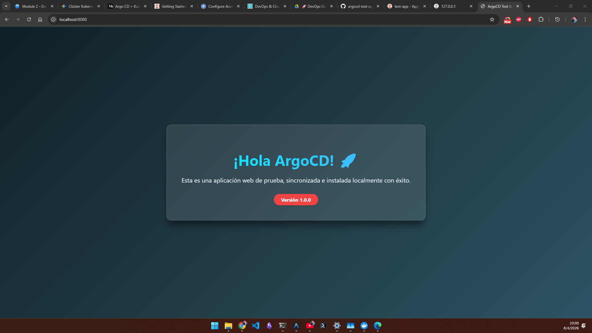

# Guía: Instalación y Pruebas Iniciales de ArgoCD (Local con Minikube)

## 📌 Contexto
Esta bitácora documenta los pasos exactos realizados para levantar un clúster local en Windows usando Minikube, instalar ArgoCD, y desplegar automáticamente una aplicación de prueba mediante la metodología GitOps.

## 🛠️ 1. Requisitos Previos y Entorno
- **Sistema Operativo**: Windows
- **Motor de Contenedores**: Docker (utilizado como driver predeterminado para Minikube)
- **Terminales utilizadas**: PowerShell y Git Bash

---

## 🚀 2. Inicialización de Kubernetes
El primer paso fue iniciar el clúster de Kubernetes usando Minikube con el driver de Docker:
```powershell
minikube start --driver=docker
```
Previo a esto, también hubo intentos iniciales configurando un driver de virtualbox (`minikube start --driver=virtualbox`) y ajustes a las variables de entorno (`$env:PATH`) para asegurar que el sistema utilizaba la versión correcta de `kubectl` administrada por Minikube.

---

## 🏗️ 3. Instalación de ArgoCD
Para instalar ArgoCD en el clúster, creamos un Namespace exclusivo y aplicamos el manifiesto oficial de ArgoProj directamente desde su repositorio:

```powershell
# 1. Crear namespace exclusivo para ArgoCD
kubectl create namespace argocd

# 2. Instalar los componentes de ArgoCD
kubectl apply -n argocd -f https://raw.githubusercontent.com/argoproj/argo-cd/stable/manifests/install.yaml
```

### 3.1. Exponiendo la interfaz de ArgoCD
Por defecto, la interfaz gráfica de ArgoCD (`argocd-server`) no está expuesta hacia nuestro entorno en Windows. Para acceder a ella, parchamos (modificamos en vivo) el servicio para usar un balanceador de carga y abrimos un túnel propio para minikube:

```powershell
# Convertir el servicio a un "LoadBalancer"
kubectl patch svc argocd-server -n argocd -p '{"spec": {"type": "LoadBalancer"}}'

# Abrir túnel temporal de red para asignar una IP (Se debe mantener corriendo)
minikube tunnel
```

### 3.2. Extracción de Contraseña (Admin)
La contraseña principal autogenerada se guarda codificada en Base64. A través de la terminal, comprobamos cómo desencriptarla de los *secrets* de k8s hacia texto puro usando una línea de PowerShell:
```powershell
[System.Text.Encoding]::UTF8.GetString([System.Convert]::FromBase64String($pass))
```
*(El usuario predeterminado de ArgoCD siempre es `admin`)*.

---

## 🌐 4. Creación y Despliegue de la Aplicación de Prueba
Tras obtener acceso al panel web, el objetivo era implementar la metodología GitOps, usando ArgoCD para leer componentes directamente desde GitHub.

### 4.1. Archivos Kubernetes en Local
Generamos una estructura clásica de aplicación web estática montada en un servidor Nginx, y la ubicamos en `/argocd-test-app/`:
1. `k8s/configmap.yaml`: Contenía la sintaxis HTML personalizada.
2. `k8s/deployment.yaml`: Plantilla encargada de levantar los contenedores de Nginx.
3. `k8s/service.yaml`: Creaba el NodePort de salida `30080`.
4. `argo-application.yaml`: El archivo fundamental para comunicarle a ArgoCD de dónde leer estos 3 manifiestos.

### 4.2. Error de Autenticación (`authentication required`)
- **Problema**: ArgoCD arrojó un error en tiempo real: `ComparisonError: authentication required: Repository not found`. Esto porque el repositorio creado inicialmente carecía permisos y era **Privado**.
- **Solución temporal adoptada**: Se cambió la visibilidad del repositorio en la plataforma de GitHub de Privado a **Público** para facilitar la lectura automatizada sin requerimientos de tokens (*Personal Access Tokens*).

### 4.3. Conexión Rápida de Git
Al ser un proyecto creado localmente después del repositorio de GitHub, se fusionaron configuraciones con la siguiente secuencia:
```bash
git init
git add .
git commit -m "Commit desde mi maquina local"
git branch -M main
git remote add origin https://github.com/cps20/argocd-test-app.git
git push -u origin main --force
```

---

## ✅ 5. Resultados Finales
Le indicamos a Kubernetes que levantara la aplicación principal mediante el llamado manual al manifiesto desde la computadora host:

```powershell
kubectl apply -f C:\Users\crisp\.gemini\antigravity\scratch\argocd-test-app\argo-application.yaml
```

**Problema de Red en Localhost (Connection Refused)**  
A pesar de la sincronización perfecta (`Healthy` y `Synced`) con NodePort, la red de Minikube no lograba re-direccionar correctamente a Windows a través de `127.0.0.1:30080`. Esto es un impedimento estándar de enrutamiento.
Para by-passear este problema y ver la aplicación funcionando, abrimos los puertos de manera unida con:
```bash
kubectl port-forward svc/argocd-test-service 8080:80
```
**Resultado:** Aplicación web exitosamente visualizada en `http://localhost:8080`!



---

## 🔄 6. Cómo retomar el proyecto (Días posteriores)
Dado que Minikube guarda el "estado" de Kubernetes en su máquina virtual, no es necesario volver a instalar ArgoCD ni la aplicación al reiniciar la computadora. Sin embargo, los túneles de red locales se cierran.

Para volver a probar el proyecto al día siguiente, debes ejecutar esta pequeña rutina en terminales:

1. **Despertar el clúster**:
   ```bash
   minikube start
   ```
   *¿Por qué?* Enciende la máquina virtual y levanta todos los contenedores de Kubernetes que instalamos previamente. Toma un par de minutos en estabilizar todo.

2. **Reconectar la interfaz de ArgoCD (Opcional)**:
   ```bash
   minikube tunnel
   ```
   *¿Por qué?* El panel de ArgoCD usa un "LoadBalancer". Al estar en un entorno local y no en la nube de AWS/GCP, Minikube requiere mantener este comando corriendo en una terminal abierta para simular una IP de balanceador y que puedas entrar a la UI administrativa.

3. **Reconectar el acceso a tu Página Web**:
   ```bash
   kubectl port-forward svc/argocd-test-service 8080:80
   ```
   *¿Por qué?* Crea un puente directo temporal entre el puerto 80 del servicio de tu red en Kubernetes hacia el puerto local 8080 de tu computadora en Windows, garantizando que el navegador pueda entrar a `http://localhost:8080`.

---

## 📚 7. Referencias Bibliográficas
* [Argo CD & Kubernetes: GitOps the right way](https://medium.com/@ebane2022/argo-cd-kubernetes-gitops-the-right-way-dca7b6fc1a77)
* [Configure Access to Multiple Clusters (Kubernetes Docs)](https://kubernetes.io/docs/tasks/access-application-cluster/configure-access-multiple-clusters/)
* [Getting Started - Argo CD Official Documentation](https://argo-cd.readthedocs.io/en/stable/getting_started/)